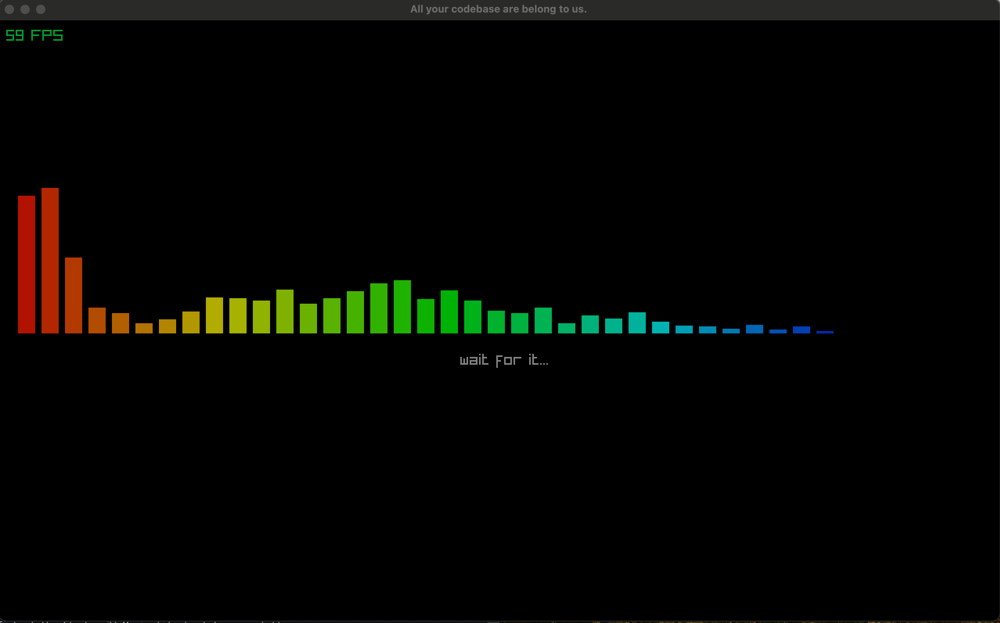

# zigualizer
Zigualizer: A music visualizer built with Zig, powered by the FFT algorithm.
[Click here](https://youtu.be/6h9Bty-wdMA) for a demo on YouTube!



## Details
This implementation was originally based on the [Musializer project by @Tsoding](https://github.com/tsoding/musializer/blob/master/src/plug.c).
This version as it stands has been tested to work with Raylib 5.0.
I have modified this version to be backed by a generic circular buffer over a 
fixed size array. Additionally, I am leveraging comptime in a few spots to
generate some static windowing functions.

## Raylib integration
For a more thorough example see raylib.zig in the examples/ folder.
Integration is a 4-step process (aside from music stream code).

```zig
// 1. Import
const fft = @import("zigualizer");

// 2. Init
fft.FFT_Analyzer.reset();

// After loading up a Raylib Music stream.
track = c.LoadMusicStream(pathToTrack);
defer c.UnloadMusicStream(track);

// 3. Attach
c.AttachAudioStreamProcessor(track.stream, fft.FFT_Analyzer.fft_process_callback);
c.PlayMusicStream(track);

// In your update loop
fn update() void {
    c.UpdateMusicStream(track);
    // 4. Analyze
    frames = fft.FFT_Analyzer.analyze(c.GetFrameTime());
}

// In your draw loop render the FFT however you like!
fn draw() void {
    c.BeginDrawing();
    defer c.EndDrawing();
    c.ClearBackground(c.BLACK);
    
    // 5. Draw
    renderFFT(400, 200);
}
```

## Building the examples
```sh
# Run the Raylib demo.
zig build -Dexample-name=raylib.zig && zig-out/example/raylib
```
